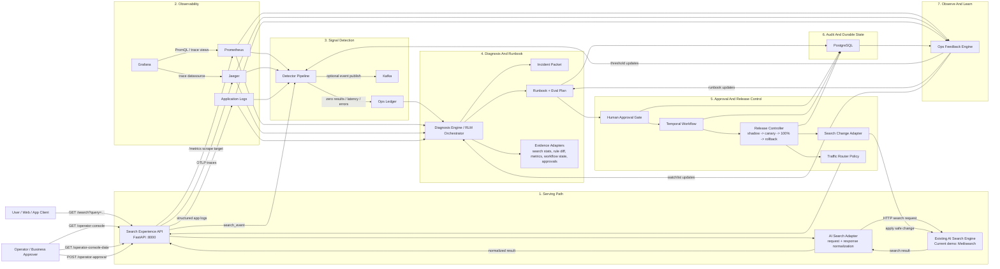

# Enterprise Low-Level Control Plane Diagram

## Purpose

This page shows the system in the **enterprise shape it should have**.

The key assumption is:

- the **AI Search Engine already exists**
- in the demo, **Meilisearch is only the mock replacement for that search engine**
- this project is the **AI Ops control plane** around the search engine

So this document is not trying to redraw the search engine internals.  
It shows how the control plane connects to the search engine, watches it, diagnoses problems, and releases changes safely.

## Single Low-Level Enterprise Diagram

## How To Read This Diagram

### 1. The user path is short

The user only depends on the serving path:

- `User -> Search Experience API -> AI Search Adapter -> AI Search Engine -> response`

This path should stay fast and simple.

### 2. The control plane is separate

Everything else happens **around** the search engine:

- observability watches the search engine
- detectors turn abnormal patterns into signals
- diagnosis explains what likely broke
- runbook logic proposes the fix
- approval and Temporal control whether the fix can move forward
- release control safely applies the change to the search engine

### 3. Meilisearch is only the stand-in

For the demo:

- `Existing AI Search Engine` = `Meilisearch`

For enterprise deployment:

- replace that box with the real `Grid Dynamics AI Search Engine`
- keep the rest of the control plane pattern the same

## Real Endpoint And Connection Map

| Connection | Current implementation | Why it exists |
|---|---|---|
| User -> API | `GET /search?query=...` | Search entrypoint |
| Operator -> API | `GET /operator-console` | Human workflow UI |
| Operator -> API | `GET /operator-console-data` | Aggregated control-plane payload |
| Operator -> API | `POST /operator-approval` | Approval / rejection |
| API -> Search engine | `POST /indexes/books/search` or `POST /indexes/books_shadow/search` | Search execution in demo |
| API -> Prometheus | `/metrics` scrape target and PromQL reads | Metrics evidence |
| API -> Jaeger | OTLP traces | Trace evidence |
| Detector -> Kafka | signal publish | Optional event fan-out |
| RCA -> Evidence adapters | search stats, settings diff, metrics, approvals, workflow state | Root-cause support |
| Approval -> PostgreSQL | approval log | Durable review history |
| API / Worker -> Temporal | workflow calls and signals | Durable release orchestration |
| Release controller -> Search change adapter | candidate sync / phase change / rollback | Safe rollout control |

## What Each Layer Owns

| Layer | Main job | Typical owner |
|---|---|---|
| Search Experience API | user-facing search endpoint and operator API | Backend/API Team |
| AI Search Adapter | hide engine-specific request/response details | Backend + Search Platform |
| Existing AI Search Engine | serve search results | Search Platform Team |
| Observability | collect metrics, traces, logs | Platform / SRE |
| Detector Pipeline | convert symptoms into signals | AI Ops / Incident Intelligence |
| Diagnosis Engine / RLM | identify affected capability and likely cause | AI Ops / Incident Intelligence |
| Runbook + Eval | propose fix and test plan | AI Ops + Search / Relevance |
| Approval Gate | human risk acceptance | Product / Business Approver |
| Temporal + Release Controller | safe rollout and rollback | Platform / SRE |
| PostgreSQL audit state | approvals, release history, evidence | Platform / SRE + Backend |

## What We Solved In The Current Prototype

We solved the **control plane problem**, not the search-engine problem.

Current prototype behavior:

- `Meilisearch` acts as the mock existing search engine
- `FastAPI` acts as the search API and orchestration layer
- `Prometheus`, `Grafana`, and `Jaeger` provide observability
- detectors create operational signals
- diagnosis and RLM logic produce incident packets and runbooks
- operator approval is stored durably
- Temporal manages staged rollout state
- release logic applies shadow / canary / rollback behavior around the mock engine

## Enterprise Replacement Rule

If the real enterprise `AI Search Engine` is available later, only these adapters should need to change:

- `AI Search Adapter`
- `Search Change Adapter`
- `search stats / settings evidence adapter`

Everything else should remain the same:

- signal detection
- diagnosis and RLM analysis
- runbook creation
- approval workflow
- Temporal orchestration
- observability usage
- audit and learning loop

## One-Line Summary

This project should be presented as:

**an AI Ops control plane for enterprise search, with Meilisearch currently used only as the mock existing search engine in the demo.**
