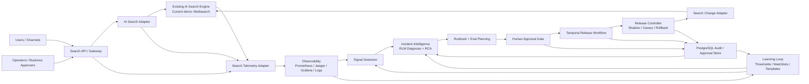

# Enterprise Executive Architecture

## Purpose

This is the **clean executive architecture view** of the system.

Use this version when the audience needs to understand:

- what the system is
- where the existing AI Search Engine fits
- where observability fits
- where the agentic intelligence fits
- how approval and release are controlled

This diagram intentionally uses a smaller number of boxes than the engineering view.

## Executive Architecture Diagram

## What Each Box Means

### `Search API / Gateway`

The stable entrypoint for users and operator tools.

It is responsible for:

- receiving `/search` traffic
- exposing operator endpoints
- attaching request IDs, trace IDs, and session context

### `AI Search Adapter`

This hides vendor-specific search behavior.

In the current demo:

- it talks to `Meilisearch`

In the target enterprise model:

- it would talk to the real `Grid Dynamics AI Search Engine`

### `Existing AI Search Engine`

This is the actual serving engine.

It is **not** the AI Ops system.

Its job is to:

- understand and execute search
- retrieve results
- apply ranking and rule logic
- return search responses

### `Search Telemetry Adapter`

This normalizes the telemetry coming from the serving path.

It should collect:

- query and result count
- latency and errors
- ranking/index version
- candidate vs baseline details
- search analytics signals

### `Observability`

This stores and visualizes evidence.

Typical systems:

- `Prometheus`
- `Jaeger`
- `Grafana`
- log / analytics pipeline

This layer is not agentic.

### `Signal Detection`

This turns raw telemetry into operational signals.

Examples:

- zero-result cluster
- latency spike
- search failure spike
- ranking regression

This layer should be deterministic and policy-driven.

### `Incident Intelligence`

This is the main **agentic** box.

It performs:

- affected capability analysis
- data gap and rule-diff analysis
- metric impact analysis
- owner-path analysis
- root-cause synthesis

This layer should explain and recommend, but not directly control releases.

### `Runbook + Eval Planning`

This turns diagnosis into an action plan.

It should produce:

- candidate fix
- owner
- eval dataset
- success criteria
- rollback plan

This is best designed as a hybrid:

- deterministic structure
- optional LLM help for explanation and wording

### `Human Approval Gate`

This is where business and operations approve or reject risky changes.

It should always capture:

- who approved
- why they approved
- what risks were reviewed

### `Temporal Release Workflow`

This is the durable orchestration layer.

It owns:

- approval state
- shadow phase
- canary phase
- promotion
- rollback

This is not agentic.

### `Release Controller`

This enforces the live rollout policy.

It applies:

- shadow replay
- canary traffic
- full rollout
- rollback

This should always remain deterministic.

### `Search Change Adapter`

This is the engine-specific release adapter.

It applies safe changes to the search engine, such as:

- candidate index sync
- ranking updates
- synonym updates
- active version switch

### `PostgreSQL Audit / Approval Store`

This is the durable control-plane record.

It stores:

- approvals
- incident history
- runbook snapshots
- release and rollback events

### `Learning Loop`

This improves the system over time.

It updates:

- thresholds
- watchlists
- runbook templates
- approval policies

## What Is Agentic And What Is Not

### Agentic

- `Incident Intelligence`
- optional narrative generation inside `Runbook + Eval Planning`

### Not agentic

- Search API / Gateway
- AI Search Adapter
- Existing AI Search Engine
- Search Telemetry Adapter
- Observability
- Signal Detection
- Human Approval Gate
- Temporal Release Workflow
- Release Controller
- Search Change Adapter
- PostgreSQL Audit / Approval Store

## Executive Summary

This system should be described as:

**an AI Ops control plane around an existing AI Search Engine, where telemetry drives detection, agentic diagnosis explains incidents, humans approve risky changes, and Temporal controls safe rollout and rollback.**
