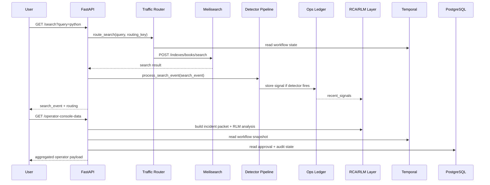

# Enterprise Low-Level Architecture

## Purpose

This document explains the system at **low-level enterprise architecture depth**.

It focuses on:

- public endpoints
- internal service-to-service calls
- ports and protocols
- workflow and control-plane connections
- where the agent-style logic actually lives

The goal is to make the implementation understandable to an engineering audience without reducing everything to vague “AI” boxes.

## Deployment Topology

### Host-facing endpoints

| Service | Host URL / Port | Purpose |
|---|---|---|
| FastAPI app | `http://localhost:8000` | Public API and operator console |
| Meilisearch | `http://localhost:7701` | Mock search engine for the demo |
| Prometheus | `http://localhost:9090` | Metrics query backend |
| Grafana | `http://localhost:3001` | Dashboards |
| Jaeger UI | `http://localhost:16686` | Trace UI |
| Jaeger OTLP | `http://localhost:4318` | Trace ingestion endpoint |
| Kafka | `localhost:9092` | Host-facing broker access |
| PostgreSQL | `localhost:5435` | Approval and audit persistence |
| Temporal gRPC | `localhost:7233` | Workflow runtime endpoint |
| Temporal UI | `http://localhost:8088` | Workflow inspection UI |

### Internal container endpoints

| Service | Internal endpoint | Used by |
|---|---|---|
| App | `http://app:8000` | Prometheus scrape target |
| Meilisearch | `http://meilisearch:7700` | App and Temporal worker |
| Prometheus | `http://prometheus:9090` | App metrics query adapter |
| Jaeger OTLP | `http://jaeger:4318` | App trace exporter |
| Kafka | `kafka:29092` | App Kafka producer |
| PostgreSQL | `postgres:5432` | App approval/audit persistence |
| Temporal | `temporal:7233` | App and worker workflow runtime |
| Ollama (optional) | `http://host.docker.internal:11434` | Optional LLM enrichment |

## Enterprise Component Diagram With Real Connections

```mermaid
flowchart TB
    U["User / Client"] -->|GET /search?query=...| API["FastAPI :8000"]
    O["Operator Browser"] -->|GET /operator-console| API
    O -->|GET /operator-console-data?use_llm=true| API
    O -->|POST /operator-approval| API

    API -->|POST /indexes/{books|books_shadow}/search| MEILI["Meilisearch :7700"]
    API -->|GET /api/v1/query| PROM["Prometheus :9090"]
    API -->|OTLP HTTP /v1/traces| JAEGER["Jaeger :4318"]
    API -->|SQLAlchemy / TCP| PG["PostgreSQL :5432"]
    API -->|Kafka bootstrap| KAFKA["Kafka :29092"]
    API -->|gRPC client| TEMP["Temporal :7233"]
    API -->|POST /api/chat optional| OLLAMA["Ollama :11434"]

    TEMPW["Temporal Worker"] -->|gRPC worker poll| TEMP
    TEMPW -->|POST /indexes/*| MEILI
    TEMPW -->|GET /api/v1/query| PROM
    TEMPW -->|SQLAlchemy / TCP| PG

    PROM -->|GET /metrics scrape| API
    GRAF["Grafana :3000"] -->|PromQL queries| PROM
    GRAF -->|Trace datasource| JAEGER
```

## Public API Surface

### Search-serving endpoints

| Method | Endpoint | Purpose |
|---|---|---|
| `GET` | `/search?query=<text>` | Execute search through the traffic router |
| `GET` | `/signals` | Return in-memory recent signals |
| `GET` | `/metrics` | Prometheus scrape endpoint |
| `GET` | `/health` | App health |
| `GET` | `/kafka-health` | Kafka readiness |
| `GET` | `/temporal-health` | Temporal connectivity |
| `GET` | `/diagnostics` | Service-level RCA and anomalies |

### Incident intelligence endpoints

| Method | Endpoint | Purpose |
|---|---|---|
| `GET` | `/incident-packet` | Deterministic incident packet |
| `GET` | `/incident-packet-llm` | Incident packet with optional LLM enrichment |
| `GET` | `/rlm-incident-analysis` | Code-first RLM decomposition |
| `GET` | `/rlm-incident-analysis-llm` | RLM decomposition plus optional LLM synthesis |
| `GET` | `/incident-report.md` | Rendered incident markdown |

### Release-control endpoints

| Method | Endpoint | Purpose |
|---|---|---|
| `GET` | `/controlled-release-packet` | Release-evaluation packet |
| `GET` | `/controlled-release-packet-llm` | Release packet with optional LLM enrichment |
| `GET` | `/controlled-release-audit-ledger` | Release audit history |
| `GET` | `/controlled-release-report.md` | Rendered release markdown |
| `GET` | `/shadow-test` | Baseline vs candidate comparison |
| `GET` | `/traffic-router-status` | Live routing phase and readiness |
| `POST` | `/shadow-index-sync?force=true` | Sync candidate index |
| `GET` | `/temporal-release-status?incident_id=...` | Workflow snapshot |
| `POST` | `/temporal-release-refresh` | Refresh Temporal workflow context |
| `POST` | `/temporal-release-phase` | Move to canary / promote / complete |
| `POST` | `/temporal-release-rollback` | Trigger rollback |

### Operator-console endpoints

| Method | Endpoint | Purpose |
|---|---|---|
| `GET` | `/operator-console` | HTML operator UI |
| `GET` | `/operator-console-data?use_llm=<bool>` | Aggregated control-plane payload |
| `POST` | `/operator-approval` | Record approval / rejection |

## Internal Service Connections

### 1. Search request path

**Entry endpoint**

- `GET /search?query=<text>`

**Internal calls**

1. FastAPI receives the request.
2. `route_search(...)` reads the latest release policy.
3. The app calls Meilisearch:
   - `POST http://meilisearch:7700/indexes/books/search`
   - or `POST http://meilisearch:7700/indexes/books_shadow/search`
4. The visible result is returned to the client.
5. The same result is forwarded into signal processing.

### 2. Signal detection path

**Internal sequence**

- `process_search_event(search_event)`
- `detect_zero_result(search_event)`
- `detect_latency_issue(search_event)`
- `detect_search_errors(search_event)`

**Resulting writes**

- append signal to in-memory `ops ledger`
- increment Prometheus metrics in-process
- optionally publish event to Kafka at `kafka:29092`

### 3. Diagnostics path

**Entry endpoint**

- `GET /diagnostics`

**Internal checks**

- search backend connectivity through `http://meilisearch:7700`
- Kafka bootstrap through `kafka:29092`
- PostgreSQL through `postgres:5432`
- Jaeger OTLP through `jaeger:4318`
- Temporal through `temporal:7233`

This path is for **service health correlation**, not for end-user serving.

### 4. Controlled-release packet path

**Entry endpoint**

- `GET /controlled-release-packet`

**Internal calls**

1. build incident packet
2. query Prometheus:
   - `GET http://prometheus:9090/api/v1/query?...`
3. combine telemetry with incident and rollout state
4. return rollout guardrails and release stages

### 5. Shadow-test path

**Entry endpoint**

- `GET /shadow-test`

**Internal calls**

1. select eval queries
2. verify candidate index readiness
3. call Meilisearch baseline and candidate indexes
4. compare:
   - result count
   - latency
   - top hits
   - index availability

### 6. Temporal workflow path

**Workflow endpoints**

- `GET /temporal-release-status`
- `POST /temporal-release-refresh`
- `POST /temporal-release-phase`
- `POST /temporal-release-rollback`

**Internal connections**

- FastAPI app -> Temporal gRPC client at `temporal:7233`
- Temporal worker -> `collect_release_context_activity`
- Activity -> controlled-release packet builder
- Activity -> shadow-test builder
- Activity -> Meilisearch + Prometheus

### 7. Approval and audit path

**Approval**

- `POST /operator-approval`
- stored in PostgreSQL table `controlled_release_approval_log`
- approval is signaled into the Temporal workflow

**Audit**

- stored in PostgreSQL table `controlled_release_audit_log`
- surfaced through `/controlled-release-audit-ledger`

## Low-Level Control-Plane Sequence



## Agent / RLM Boundary

The `agent-style logic` is **not** the search engine.

It lives in the **incident intelligence layer**.

### Parent orchestrator

- builds one `RLMIncidentContext`
- launches focused subtasks in parallel
- merges findings into one synthesis
- optionally calls Ollama for summary rewriting

### Focused subtasks

- `Affected Capability`
- `Data Gap And Rule Diff`
- `Metric Impact`
- `Owner Path`

### Internal evidence adapters

- Meilisearch search/index stats reader
- Meilisearch settings diff reader
- Prometheus query adapter
- Temporal workflow state reader
- PostgreSQL approval/audit reader

### Enterprise rule

The LLM does **not** control:

- live traffic routing
- approval gating
- canary percentage
- rollback trigger

Those remain deterministic control-plane functions.

## Ownership By Connection Boundary

| Boundary | Owning team |
|---|---|
| Client -> FastAPI API | Backend/API Team |
| FastAPI -> Search engine | Search Platform Team |
| FastAPI -> Prometheus / Jaeger | Platform / SRE Team |
| Detectors -> Ops ledger / Kafka | AI Ops / Incident Intelligence Team |
| FastAPI -> Temporal | Platform / SRE Team |
| Approval / audit persistence | Platform / SRE + Backend |
| Business approval action | Product / Business Approver |

## Summary

At low level, this system is:

- a search-serving API
- a telemetry-driven incident detector
- a code-first diagnosis and runbook engine
- a Temporal-controlled release workflow
- a PostgreSQL-backed audit and approval system

In the current demo, `Meilisearch` is the mock search engine.  
In the enterprise target model, that search-engine box is replaced, but the control-plane patterns remain the same.
