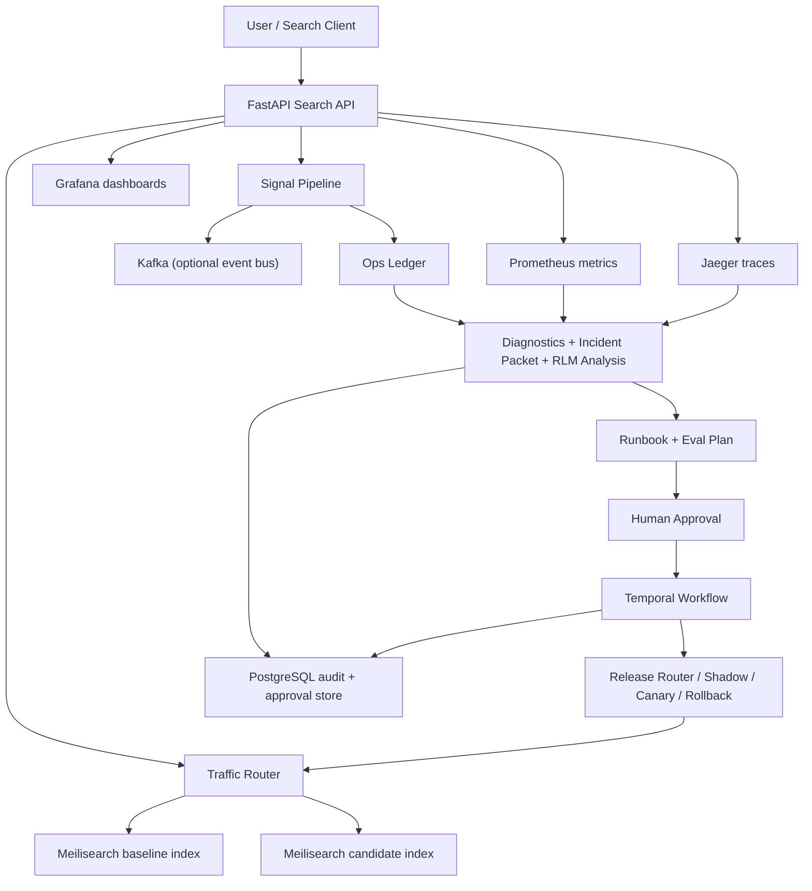
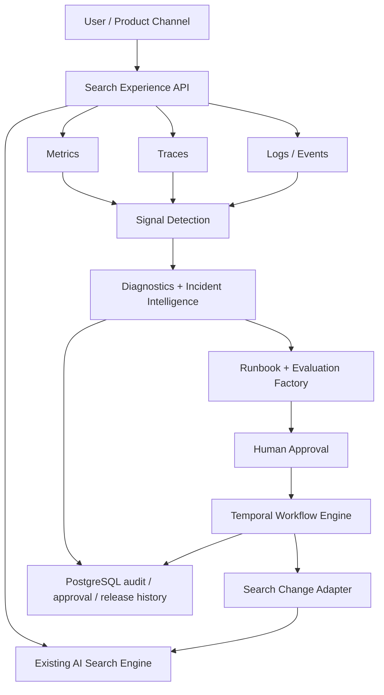

# Search Incident Control System Architecture

## 1. Purpose In Plain English

This project is a **smart control room around a search engine**.

In the current demo, `Meilisearch` plays the role of the **mock search engine**.  
In the target enterprise model, a real `AI Search Engine` already exists and this project becomes the **AI Ops control plane** that watches the search engine, detects incidents, diagnoses what went wrong, prepares a runbook, routes approvals, and safely releases or rolls back changes.

The system is deliberately split into:

- a **serving plane** that answers search requests
- an **observability plane** that measures behavior
- a **decision plane** that explains incidents and recommends action
- an **execution plane** that enforces approvals and staged rollout

## 2. Current Demo Architecture

## 3. Current Layer-By-Layer Breakdown

### Serving Plane

- `FastAPI` receives `/search` requests.
- `Traffic Router` decides whether the request should use:
  - the baseline search index
  - the candidate index
  - shadow replay in the background
- `Meilisearch` is the **mock search engine**, not an agent tool.
- Search responses are returned to the user immediately.

### Detection Plane

- Every search result is converted into a `search_event`.
- Detectors inspect the event for:
  - repeated zero results
  - latency spikes
  - search API failures
- If a detector fires, the system emits a `signal`.
- Signals are stored in the in-memory `ops ledger` and optionally published to Kafka.

### Observability Plane

- `Prometheus` captures metrics such as request count, latency, signal totals, and zero-result totals.
- `Jaeger` captures traces for search requests and signal processing.
- `Grafana` visualizes those metrics and traces for operators.
- Observability is **evidence**, not the search engine itself.

### Decision Plane

- `Diagnostics / RCA Engine` checks health across search, Kafka, Postgres, Redis, telemetry, and Temporal.
- `Incident Packet` turns raw signals into:
  - affected capability
  - root-cause hypothesis
  - evidence pack
  - owner mapping
- `Controlled Release Packet` turns diagnosis into:
  - evaluation plan
  - promotion guardrails
  - rollback criteria
- `RLM Analysis` decomposes the incident into focused sub-investigations and recombines the results.

### Execution Plane

- `Human Approval` is required for risky changes.
- `Temporal` keeps the workflow durable across:
  - approval
  - refresh
  - canary progression
  - rollback
- `Release Router` enforces staged rollout:
  - shadow
  - canary 5%
  - canary 25%
  - promote 100%
  - rollback

### State And Audit

- `PostgreSQL` stores approval records and release audit history.
- The audit ledger is the durable source for who approved what and when.

## 4. Low-Level Runtime Flow

### 4.1 Serving Path

`/search` -> `traffic router` -> `baseline/candidate Meilisearch index` -> `search_event` -> `signal processing`

Detailed behavior:

1. `FastAPI` receives the query.
2. `Traffic Router` reads the latest Temporal release phase and approval state.
3. The router chooses the visible index:
   - baseline for normal traffic
   - candidate for approved canary traffic
   - baseline plus background candidate replay during shadow
4. `Search Service` calls Meilisearch through HTTP.
5. The result becomes a `search_event`.
6. The event is passed through the detector pipeline.
7. If a detector fires, a signal is stored and optionally published.

### 4.2 Detection Path

`search_event` -> `detectors` -> `ops ledger` -> `Kafka / metrics`

Detectors currently cover:

- `zero_result_cluster`
- `latency_spike`
- `search_api_failure`

This means the system is **watching user behavior**, not only backend health.

### 4.3 Incident Assembly Path

`signals + diagnostics + telemetry + shadow results + workflow state` -> `operator console payload`

The operator console is a composed control-plane view. It assembles:

- recent signals
- diagnostics
- incident packet
- controlled release packet
- shadow test report
- Temporal workflow state
- traffic-router status
- RLM analysis

### 4.4 RLM / Agent Path

`parent orchestrator` -> `focused subtasks` -> `merged synthesis` -> `optional LLM enrichment`

Current subtasks:

- `Affected Capability`
- `Data Gap And Rule Diff`
- `Metric Impact`
- `Owner Path`

Each subtask gets a **focused evidence window** and produces:

- `CodeAct steps`
- findings
- recommendations
- confidence

The parent orchestrator merges those outputs into one incident-level summary.

### 4.5 Temporal Rollout Path

`approval` -> `Temporal workflow` -> `release phase` -> `traffic router enforcement`

Temporal owns the durable release workflow state:

- awaiting approval
- approved but blocked
- ready for canary
- in canary
- completed
- rolled back

The traffic router reads that workflow state and enforces it on live request routing.

### 4.6 Shadow / Canary Path

`candidate index ready` -> `shadow replay` -> `guardrail check` -> `canary` -> `promote or rollback`

The candidate path is validated in stages:

1. sync or create the candidate index
2. mirror representative queries into the candidate path
3. compare baseline vs candidate
4. allow canary only after:
   - shadow readiness
   - approval
   - no critical regression
5. promote gradually or roll back

## 5. Agent And Tool-Calling Boundary

### What The Current System Is

The current design is **code-first orchestration with optional LLM synthesis**.

That means:

- code decides what evidence to gather
- code calls the real systems
- the LLM only helps explain or summarize the result

### What The LLM Does

- writes incident summaries
- explains likely root cause
- restructures runbook language
- suggests clearer action ordering

### What The LLM Does Not Control

- traffic routing
- canary percentages
- approval gating
- rollback triggers
- workflow state transitions

### Internal Evidence Adapters

These are technical subcomponents, not primary business boxes:

- `search/index stats reader`
- `search/index settings diff reader`
- `Prometheus query adapter`
- `Temporal state reader`
- `approval / audit reader`

These adapters feed the diagnosis layer with real evidence.

## 6. Target Enterprise Architecture

## 7. Current Demo To Target Enterprise Evolution

| Concern | Current Demo | Target Enterprise |
|---|---|---|
| Search engine | Meilisearch mock engine | Existing AI Search Engine |
| Serving path | FastAPI + baseline/candidate Meilisearch | FastAPI + enterprise search engine |
| Diagnosis | RCA + incident packet + RLM analysis | same, but pointed at enterprise search telemetry and controls |
| Rollout control | Temporal + candidate index routing | Temporal + Search Change Adapter into enterprise platform |
| Observability | Prometheus, Grafana, Jaeger | same pattern, likely with richer production sources |
| Business control | operator console + approval store | same pattern, integrated with enterprise workflows |

## 8. Ownership Map

### Search Platform Team

- Owns the search-serving platform behavior.
- In the demo, that is effectively the `Meilisearch serving path`.
- In the target state, that becomes the `existing AI Search Engine`.

### Backend / API Team

- Owns FastAPI routes and request orchestration.
- Owns the operator console APIs and payload assembly.
- Owns the integration boundary between serving and control planes.

### AI Ops / Incident Intelligence Team

- Owns detectors, RCA, incident packet generation, RLM orchestration, runbook synthesis, and evaluation planning.

### Platform / SRE Team

- Owns Temporal, Kafka, PostgreSQL, Prometheus, Grafana, Jaeger, and release safety.

### Product / Business Approver

- Owns business-impact review, guardrail acceptance, and release approval for risky changes.

## 9. Validation Checklist

After reading this architecture, a reviewer should understand:

- the search engine is `Meilisearch` in the current demo
- observability is for evidence, not search serving
- AI is used in diagnosis and runbook intelligence
- Temporal controls staged release and rollback
- humans approve risky production-facing changes
- the target state keeps the same control plane but swaps in the real enterprise AI Search Engine
